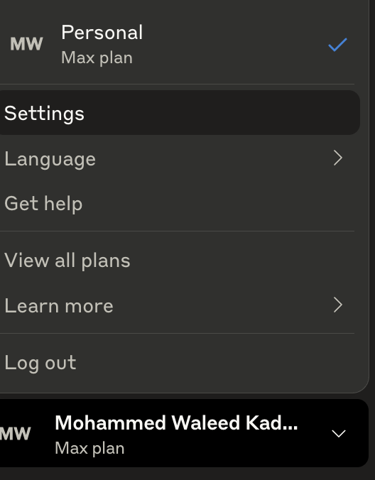
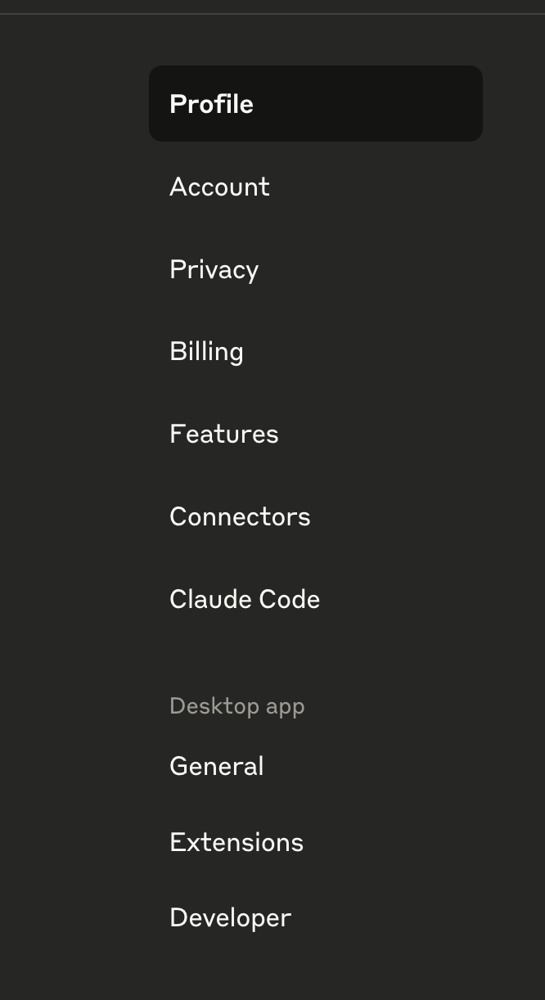
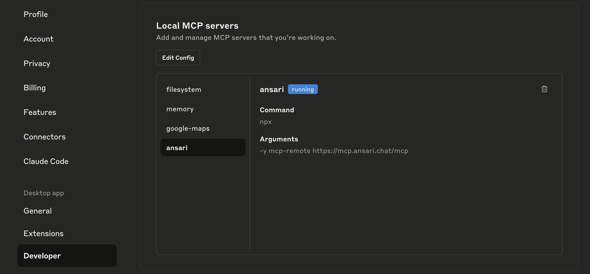

# Ansari MCP Server - Setup Guide

This guide provides detailed instructions for setting up the Ansari MCP server with various AI assistants.

## Overview

The Ansari MCP server provides Islamic knowledge through an MCP (Model Context Protocol) interface. It's available as:
- **Hosted Service**: `https://mcp.ansari.chat/mcp` (recommended - no installation required)
- **Local Server**: Run on your machine (requires Node.js)

## Supported Platforms

✅ **Claude Desktop** - Full support with mcp-remote adapter  
✅ **Claude Code** - Native HTTP support  
✅ **Cursor** - Native HTTP support  
✅ **Visual Studio Code** - With MCP extension (HTTP support)  
⚠️  **Claude Desktop Connectors** - Known issue (see troubleshooting)

## Setup Instructions

### Claude Desktop

Claude Desktop requires the `mcp-remote` adapter to connect to HTTP servers.

#### Configuration Location
- **macOS**: `~/Library/Application Support/Claude/claude_desktop_config.json`
- **Windows**: `%APPDATA%\Claude\claude_desktop_config.json`

#### How to Access Configuration

1. Open Claude Desktop and click on your profile/name in the bottom left corner
   

2. Select "Settings" from the menu
   

3. Navigate to "Developer" tab and click "Edit Config"
   

4. This will open the `claude_desktop_config.json` file in your default text editor

#### Using Hosted Server (Recommended)

1. Edit your `claude_desktop_config.json`:
```json
{
  "mcpServers": {
    "ansari": {
      "command": "npx",
      "args": [
        "-y",
        "mcp-remote",
        "https://mcp.ansari.chat/mcp"
      ]
    }
  }
}
```

2. **Important**: Completely quit Claude Desktop (Cmd+Q on Mac, Alt+F4 on Windows)
3. Restart Claude Desktop
4. The Ansari tool will be available in your conversations

#### Using Local Server

```json
{
  "mcpServers": {
    "ansari": {
      "command": "node",
      "args": ["/absolute/path/to/ansari-mcp/dist/server.js"]
    }
  }
}
```

### Claude Code

Claude Code has native support for HTTP MCP servers with a simple CLI command.

#### Using Hosted Server (Recommended)

Simply run this command in your terminal:
```bash
claude mcp add ansari -t http https://mcp.ansari.chat/mcp
```

This will automatically configure the Ansari server in your Claude Code settings.

#### Manual Configuration (Alternative)

If you prefer manual configuration, you can edit:
- Project-specific: `.claude.json` in your project root
- Global: `~/.claude.json`

```json
{
  "mcpServers": {
    "ansari": {
      "type": "http",
      "url": "https://mcp.ansari.chat/mcp"
    }
  }
}
```

#### Using Local Server

```json
{
  "mcpServers": {
    "ansari": {
      "command": "node",
      "args": ["/absolute/path/to/ansari-mcp/dist/server.js"]
    }
  }
}
```

### Visual Studio Code

VS Code with an MCP extension supports HTTP MCP servers with an easy-to-use UI.

#### Requirements
- Install an MCP extension from the VS Code marketplace

#### Using Hosted Server (Recommended)

1. Open Command Palette (Cmd+Shift+P / Ctrl+Shift+P)
2. Run "MCP: Add Server..."
3. Select "HTTP (HTTP or Server-Sent Events)"
4. Enter the URL: `https://mcp.ansari.chat/mcp`
5. Give it a name: "Ansari"

### Cursor

Cursor has native support for HTTP MCP servers.

#### Using Hosted Server (Recommended)

```json
{
  "mcpServers": {
    "ansari": {
      "type": "http",
      "url": "https://mcp.ansari.chat/mcp"
    }
  }
}
```

#### Using Local Server

```json
{
  "mcpServers": {
    "ansari": {
      "command": "node",
      "args": ["/absolute/path/to/ansari-mcp/dist/server.js"]
    }
  }
}
```

## Features

The Ansari MCP server provides:

### Tool: `answer_islamic_question`
Answers questions about Islamic theology, history, and practice based on authentic sources.

**Parameters:**
- `question` (string, required): The Islamic question to be answered

**Returns:**
- Comprehensive answer with citations from Quran and authentic Hadith
- Sources are properly referenced with chapter, verse, and hadith numbers
- Scholarly explanations based on classical Islamic texts

## Usage Examples

Once configured, you can ask questions like:

- "What are the five pillars of Islam?"
- "What does the Quran say about charity?"
- "Explain the concept of Tawheed"
- "What is the significance of Ramadan?"
- "How many times is prayer mentioned in the Quran?"
- "What are the conditions for valid prayer?"
- "Explain the story of Prophet Ibrahim"

## Verification

To verify the tool is working:

1. Start a new conversation
2. Look for the tools icon (usually a hammer or similar)
3. The `answer_islamic_question` tool should be listed
4. Ask an Islamic question - Claude will automatically use the tool

## Troubleshooting

### Tool Not Appearing

1. **Restart Required**: After adding configuration, completely quit and restart the application
2. **Check Configuration**: Ensure JSON is valid (no trailing commas, proper quotes)
3. **Path Issues**: For local server, ensure paths are absolute and correct

### Claude Desktop Connectors Issue

**Known Issue**: The Settings > Connectors interface in Claude Desktop currently has a bug where it shows "no tools available" for remote MCP servers, even with Pro/Max/Team plans.

**Workaround**: Use the `mcp-remote` adapter method shown above instead of the Connectors interface.

### Connection Errors

If you see connection errors:

1. **Hosted Server**: Check internet connection and try `curl https://mcp.ansari.chat/mcp`
2. **Local Server**: Ensure the server is built (`npm run build`) and path is correct
3. **Windows**: Use forward slashes in paths or escape backslashes

### "Command not found" Errors

If you get `npx: command not found`:
1. Install Node.js (v18 or higher): https://nodejs.org/
2. Verify installation: `node --version` and `npx --version`

## Technical Details

### Protocol
- Uses MCP (Model Context Protocol) over JSON-RPC 2.0
- Supports Streamable HTTP transport
- No authentication required (public server)

### Server Endpoints
- Main endpoint: `https://mcp.ansari.chat/mcp`
- Methods supported:
  - `initialize`: Protocol handshake
  - `tools/list`: Returns available tools
  - `tools/call`: Executes the answer_islamic_question tool
  - `resources/list`: Returns empty (no resources)
  - `prompts/list`: Returns empty (no prompts)

### Source Code
- GitHub: https://github.com/ansari-project/ansari-mcp
- Built with TypeScript and Next.js
- Deployed on Vercel

## Support

For issues or questions:
- GitHub Issues: https://github.com/ansari-project/ansari-mcp/issues
- API Documentation: https://staging-api.ansari.chat/redoc

## Version History

- v1.0.0 - Initial release with answer_islamic_question tool
- Hosted server deployment at mcp.ansari.chat
- Support for Claude Desktop, Claude Code, and Cursor