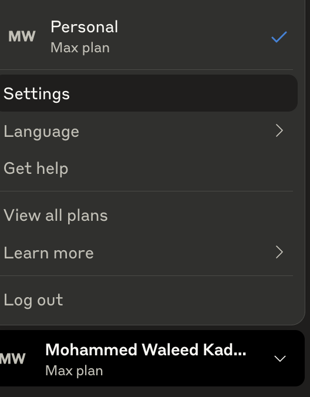
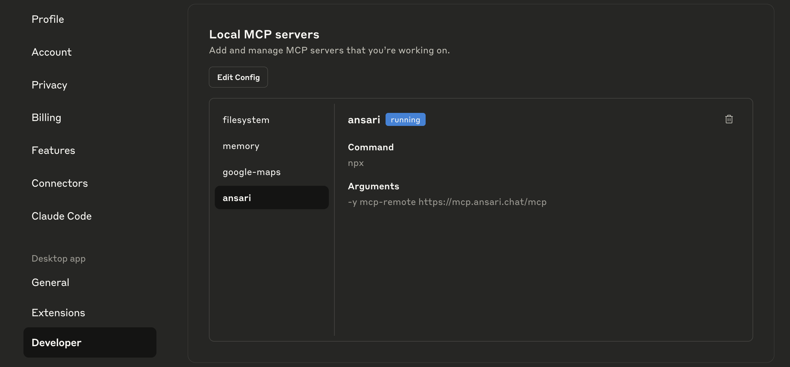

# Ansari MCP Server

An MCP (Model Context Protocol) server that provides Islamic knowledge through the Ansari API. This server allows Claude Desktop, Claude Code, Cursor, and other MCP clients to answer Islamic questions with authentic sources from the Quran and Hadith.

## Hosted Server

The Ansari MCP server is available as a hosted service at:
```
https://mcp.ansari.chat/mcp
```

You can use this URL directly in Claude Code or with adapters for Claude Desktop and Cursor (see setup instructions below).

## Quick Start - Using the Hosted Server

The easiest way to use Ansari MCP is through our hosted server. No installation required!

### Claude Desktop

1. Open Claude Desktop and click on your profile/name in the bottom left corner
   

2. Select "Settings" from the menu
   

3. Navigate to "Developer" tab and click "Edit Config"
   

4. This will open the `claude_desktop_config.json` file in your default text editor
   - **macOS**: Located at `~/Library/Application Support/Claude/claude_desktop_config.json`
   - **Windows**: Located at `%APPDATA%\Claude\claude_desktop_config.json`

5. Add this configuration:
```json
{
  "mcpServers": {
    "ansari": {
      "command": "npx",
      "args": [
        "-y",
        "mcp-remote",
        "https://mcp.ansari.chat/mcp"
      ]
    }
  }
}
```

6. Restart Claude Desktop completely (Cmd+Q / Alt+F4 and reopen)

### Claude Code

1. Open your project in Claude Code
2. Add to your `.claude.json` or global configuration:
```json
{
  "mcpServers": {
    "ansari": {
      "type": "http",
      "url": "https://mcp.ansari.chat/mcp"
    }
  }
}
```

### Visual Studio Code (with MCP Extension)

If you have an MCP extension installed in VS Code:

1. Open Command Palette (Cmd+Shift+P / Ctrl+Shift+P)
2. Run "MCP: Add Server..."
3. Select "HTTP (HTTP or Server-Sent Events)"
4. Enter URL: `https://mcp.ansari.chat/mcp`
5. Name it: "Ansari"

### Cursor

Cursor supports HTTP MCP servers directly:

```json
{
  "mcpServers": {
    "ansari": {
      "type": "http",
      "url": "https://mcp.ansari.chat/mcp"
    }
  }
}
```

## Local Installation (Optional)

If you prefer to run the server locally:

### Prerequisites

- Node.js (v18 or higher)
- npm

### Installation Steps

1. Clone the repository:
```bash
git clone https://github.com/ansari-project/ansari-mcp.git
cd ansari-mcp
```

2. Install dependencies:
```bash
npm install
```

3. Build the TypeScript code:
```bash
npm run build
```

## Development

### Building the Project

**Important**: After making ANY changes to the TypeScript source files in `src/`, you MUST rebuild:

```bash
npm run build
```

## Configuration

### API Endpoint

By default, the server connects to:
```
https://staging-api.ansari.chat/api/v2/mcp-complete
```

You can override this with the `--api-url` (or `-u`) flag:

```bash
npm start -- --api-url https://custom-api.example.com/api/endpoint
```

## Running the Server

### Mode 1: stdio (for Claude Desktop & Claude Code)

This is the default mode for integration with Claude Desktop and Claude Code:

```bash
npm start
```

### Mode 2: HTTP (for testing)

To run in HTTP mode for testing with curl or other HTTP clients:

```bash
npm start -- --http
```

The server will be available at: `http://localhost:8089/mcp`

## Local Server Configuration

If you're running the server locally instead of using the hosted version:

### Claude Desktop (Local)

```json
{
  "mcpServers": {
    "ansari": {
      "command": "node",
      "args": ["/absolute/path/to/ansari-mcp/dist/server.js"],
      "env": {}
    }
  }
}
```

### Claude Code (Local)

```json
{
  "mcpServers": {
    "ansari": {
      "command": "node",
      "args": ["/absolute/path/to/ansari-mcp/dist/server.js"],
      "env": {}
    }
  }
}
```

### Cursor (Local)

```json
{
  "mcpServers": {
    "ansari": {
      "command": "node",
      "args": ["/absolute/path/to/ansari-mcp/dist/server.js"],
      "env": {}
    }
  }
}
```

**Note**: Replace `/absolute/path/to/ansari-mcp` with your actual installation path.

## Usage

Once configured, you can ask Islamic questions in Claude Desktop or Claude Code:

1. Start a new conversation
2. The Ansari tool will be available automatically
3. Ask Islamic questions naturally, for example:
   - "What are the five pillars of Islam?"
   - "What does the Quran say about charity?"
   - "Explain the concept of Tawheed"
   - "How many times is prayer mentioned in the Quran?"

Claude will use the Ansari tool to provide answers with authentic citations from the Quran and Hadith.

## Testing

### Test the API Connection Directly

```bash
# Create a test file
cat > test-api.mjs << 'EOF'
import { askAnsari } from './dist/ansari-service.js';
askAnsari('What is zakat?').then(console.log);
EOF

# Run the test
node test-api.mjs
```

### Test with MCP Inspector

Install and run the MCP Inspector:

```bash
npx @modelcontextprotocol/inspector dist/server.js
```

This will open a web interface where you can test the tool interactively.

### Test in HTTP Mode

1. Start the server:
```bash
npm start -- --http
```

2. The server will run at `http://localhost:8089/mcp`

## Troubleshooting

### "Unexpected token" Error in Claude Desktop

**Problem**: You see `MCP ansari: Unexpected token 'C', "Calling An"... is not valid JSON`

**Solution**: This occurs when console.log statements interfere with the MCP protocol. The code should already have these removed, but if you add any debugging:
- Remove ALL `console.log()` statements
- Remove ALL `console.error()` statements
- Only pure JSON-RPC communication should go to stdout

### Changes Not Taking Effect

**Problem**: You modified the code but changes aren't working

**Solution**: You MUST rebuild after every change:
```bash
npm run build
```

### Claude Desktop Not Finding the Tool

**Problem**: The Ansari tool doesn't appear in Claude Desktop

**Solutions**:
1. Verify the path in `claude_desktop_config.json` is absolute and correct
2. Ensure you ran `npm run build` successfully
3. Completely restart Claude Desktop (quit and reopen)
4. Check the build output exists: `ls dist/server.js`

### Connection to API Fails

**Problem**: "Failed to fetch answer from Ansari API"

**Solutions**:
1. Check your internet connection
2. Verify the API is accessible: `curl https://staging-api.ansari.chat/api/v2/mcp-complete`
3. Try with a custom API URL if you have one

### Build Errors

**Problem**: TypeScript compilation fails

**Solution**:
```bash
# Clean and rebuild
rm -rf dist/
npm run build
```

## Project Structure

```
ansari-mcp/
├── src/
│   ├── server.ts           # Main MCP server implementation
│   └── ansari-service.ts   # Ansari API client service
├── dist/                   # Compiled JavaScript (generated by build)
│   ├── server.js          # Compiled server
│   └── ansari-service.js  # Compiled service
├── tmp/                    # Temporary test files (git-ignored)
├── package.json           # Project dependencies and scripts
├── tsconfig.json          # TypeScript configuration
└── README.md             # This file
```

## Important Notes

- **Always rebuild after changes**: Run `npm run build` after modifying ANY TypeScript files
- **No console output in stdio mode**: Console statements will break the MCP protocol
- **Use absolute paths**: In Claude Desktop/Code configs, always use absolute paths
- **Restart after config changes**: Always restart Claude Desktop/Code after changing configuration

## API Information

The Ansari API provides:
- Quranic verses with Arabic text and English translations
- Authentic Hadith with grading and sources
- Scholarly explanations based on classical Islamic texts
- Proper citations with chapter, verse, and hadith numbers

## Support

For issues or questions:
- Check the [Issues](https://github.com/ansari-project/ansari-mcp/issues) page
- API Documentation: https://staging-api.ansari.chat/redoc
- Contact the Ansari project team

## License

[Your License Here]